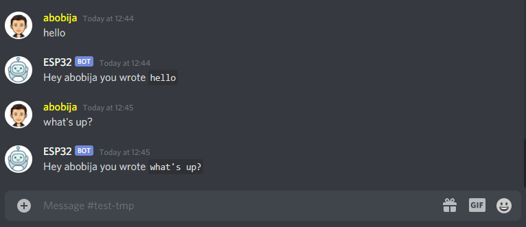

# ESP32 echo Discord bot

This is example application which represent echo [ESP32 Discord bot](https://github.com/abobija/esp-discord).

## Configuration steps:

- Run `idf.py set-target esp32`
- Open `idf.py menuconfig` and set next configs:
  - `Example Connection Configuration`
    - \> `WiFi SSID` with your wifi name
    - \> `WiFi Password` with you wifi password
  - `Component Config` > `Discord` > `Token` with your bot authentication token
- Now build, flash and monitor app.

For more check out [esp-discord](https://github.com/abobija/esp-discord) repository.

## Demo



Output:

```
I (7428) discord_bot: Bot ESP32#9421 connected
I (35998) discord_bot: New message (dm=false, autor=abobija#5474, bot=false, channel=808419120159916042, guild=805838862634451014, content=hello)
I (38358) discord_bot: Echo message successfully sent
I (38358) discord_bot: Echo message got ID #819536375585701948
I (66308) discord_bot: New message (dm=false, autor=abobija#5474, bot=false, channel=808419120159916042, guild=805838862634451014, content=what's up?)
I (66628) discord_bot: Echo message successfully sent
I (66628) discord_bot: Echo message got ID #819536494057488384
```
